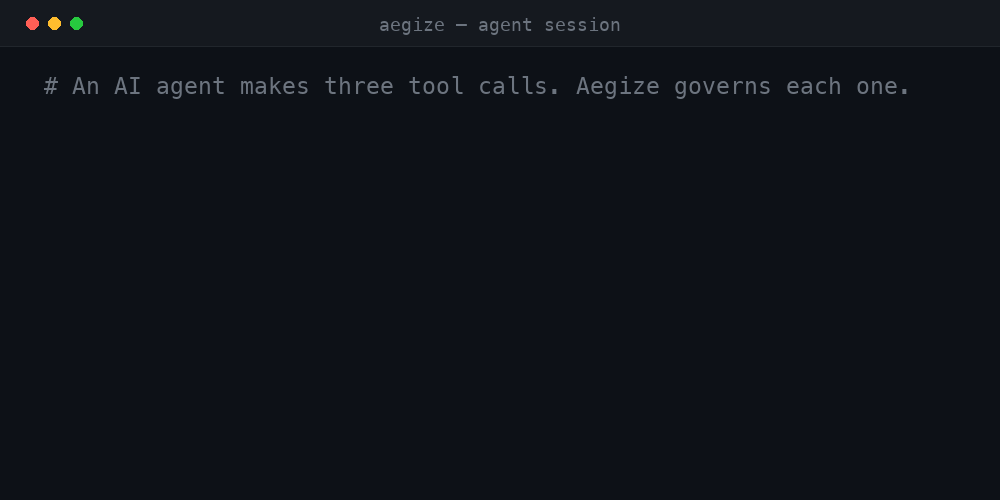

<p align="center">
  <picture>
    <source media="(prefers-color-scheme: dark)" srcset="./assets/logo-dark.png">
    
  </picture>
</p>

# Aegize

Infrastructure for autonomous AI agents.

**[Website](https://aegize.com)** • **[GitHub](https://github.com/gggaswint/aegize)**

[](https://www.python.org/downloads/)
[](./LICENSE)
[](#roadmap)
[](#roadmap)

Aegize is the runtime layer between autonomous AI agents and the tools they use.

It provides identity, policy enforcement, permissions, approval workflows, audit
logging, observability, and runtime governance for every AI action.

> Every agent action must have identity, permission, policy enforcement, and audit.

<p align="center">
  
</p>

## Architecture

<p align="center">
  
</p>

---

## See it in action

One agent attempts three tool calls. Aegize **allows** the web search,
**holds the email for approval**, **blocks the shell command**, and writes an
audit record for every attempt.

```text
$ python examples/demo_story.py

[1] web_search.search   query='AI safety companies'
    ALLOWED  -> results for 'AI safety companies'

[2] email.send          to='ceo@example.com'
    APPROVAL REQUIRED  -> held for human review (not executed)
               reason: approval required for tool 'email'

[3] shell.execute       cmd='rm -rf /var/data'
    DENIED  -> blocked before execution
               reason: denied by rule for tool 'shell'

Audit trail:
    allowed              web_search   search
    execution_succeeded  web_search   search
    approval_required    email        send
    denied               shell        execute

3 actions attempted · 1 allowed · 1 awaiting approval · 1 denied · 4 audit records written
```

The gated and denied calls never reach the underlying functions. See
[Demo](#demo) to run it yourself.

## Why Aegize?

AI systems are moving from answering questions to taking actions — running
shells, sending email, moving money, calling internal APIs. A model that only
returns text is easy to contain. An agent that *acts* is not: it needs an
identity, scoped permissions, approvals for high-impact operations, and a record
of everything it did.

That governance layer is usually missing today, and the model's own judgment
stands in for it. Aegize is the runtime infrastructure that fills the gap, so
organizations can let agents take actions without giving up control or
visibility. Security is one capability this provides; operability, reviewability,
and confidence in deployment are the rest.

## Project Vision

> Every meaningful AI action should pass through trusted runtime infrastructure
> before reaching the outside world.

## What Aegize provides

- **`AgentIdentity`** — a durable identity for each agent (owner, environment,
  metadata).
- **`PermissionPolicy`** — a YAML policy engine that returns `allow`, `deny`, or
  `require_approval`.
- **`GuardedTool` / `@guarded_tool`** — the enforcement point: wrap any callable
  so it is identified, permissioned, gated, and audited.
- **`AuditLog`** — an append-only JSONL record of every attempt and outcome.
- **Typed, dependency-light, and easy to extend.** One runtime dependency
  (PyYAML).

## Install

```bash
pip install aegize
```

Or from source:

```bash
git clone https://github.com/gggaswint/aegize
cd aegize
pip install -e ".[dev]"
```

## Quickstart

```python
from aegize import AgentIdentity, PermissionPolicy, GuardedTool, AuditLog

agent = AgentIdentity(
    agent_id="research_bot",
    name="Research Bot",
    owner="Geoffrey",
    environment="dev",
)

policy = PermissionPolicy.from_yaml("aegize.yaml")
audit = AuditLog("audit.jsonl")

def web_search(query: str) -> str:
    return f"searched: {query}"

safe_web_search = GuardedTool(
    tool_name="web_search",
    operation="search",
    func=web_search,
    agent=agent,
    policy=policy,
    audit_log=audit,
    risk_level="low",
)

result = safe_web_search("AI safety companies")
```

If the policy allows the action, the function runs and two audit records are
written (authorization + result). If not, Aegize raises `PolicyDenied` or
`ApprovalRequired` and the function never executes.

```python
from aegize import PolicyDenied, ApprovalRequired

try:
    safe_web_search("AI safety companies")
except ApprovalRequired as exc:
    # route to a human approval workflow
    ...
except PolicyDenied as exc:
    # blocked outright
    ...
```

## Decorator quickstart (v0.2)

You don't have to wrap every function by hand. Declare a tool once with
`@guarded_tool`, bundle your agent/policy/audit into a `GuardContext`, and bind
them together when you have a context.

```python
from aegize import (
    AgentIdentity, PermissionPolicy, AuditLog,
    GuardContext, guarded_tool, guard, ApprovalRequired,
)

@guarded_tool(tool_name="email", operation="send", risk_level="high")
def send_email(to: str, body: str) -> str:
    ...  # your real implementation

ctx = GuardContext(
    agent=AgentIdentity(agent_id="research_bot", name="Research Bot", owner="Geoffrey"),
    policy=PermissionPolicy.from_yaml("aegize.yaml"),
    audit_log=AuditLog("audit.jsonl"),
)

# Bind to a context -> a plain, signature-preserving callable you can register.
guarded_send = guard(send_email, context=ctx)
# e.g. server.add_tool(guarded_send)   # MCP / any tool registry

try:
    guarded_send("ceo@example.com", "Q3 numbers")
except ApprovalRequired:
    ...  # gated for human approval; send_email never ran
```

`guard()` returns a callable that preserves the original `__name__`,
docstring, and signature, so tool registries (including MCP servers) that
introspect functions keep working.

**Default context.** Inside a `with ctx:` block (or after `ctx.activate()`),
decorated tools can be called directly:

```python
with ctx:
    send_email("ceo@example.com", "Q3 numbers")  # uses the active context
```

**Per-call metadata.** Pass `guard_metadata=` to any guarded call to attach
context for policy decisions (e.g. a path for an allowlist) and the audit log.
It is stripped before your function runs:

```python
guarded_read("report", guard_metadata={"path": "./safe_data/report.txt"})
```

Both styles are fully supported — use `GuardedTool(...)` directly when you want
explicit objects, or the decorator when you want ergonomics. They share the same
enforcement and audit code.

## Policy YAML

Policies are per-agent. Each agent has `allow`, `require_approval`, and `deny`
sections. Evaluation order is **deny → require_approval → allow → default-deny**,
so an explicit `deny` always wins and anything unlisted is denied.

```yaml
agents:
  research_bot:
    allow:
      - tool: web_search
        operations: ["search"]
        risk_level_max: medium      # block this rule above 'medium' risk
      - tool: file_reader
        operations: ["read"]
        paths:
          - "./safe_data/**"        # only inside the allowlisted path

    require_approval:
      - tool: email
        operations: ["send"]
      - tool: shell
        operations: ["execute"]

    deny:
      - tool: payments
        operations: ["charge"]
      - tool: shell
        operations: ["rm", "delete"]
```

Rule fields:

| Field            | Applies to              | Meaning                                                            |
| ---------------- | ----------------------- | ----------------------------------------------------------------- |
| `tool`           | all                     | Tool name to match.                                               |
| `operations`     | all                     | Operations the rule covers. Omit to match every operation.        |
| `risk_level_max` | `allow`                 | Highest risk this rule permits (`low`…`critical`).                |
| `paths`          | `allow`                 | Glob allowlist; a string argument must match one of these.        |

> **Path matching:** when a rule has `paths`, Aegize checks the string
> arguments of the call (and `metadata["path"]`) against the glob patterns. A
> call with no matching path is denied.

## Audit log

Every attempt is appended to a JSONL file — one self-contained JSON object per
line, easy to tail, `grep`, or ship to a SIEM. A single allowed call:

```json
{"timestamp": "2026-06-27T18:00:00+00:00", "event": "allowed", "agent_id": "research_bot", "tool_name": "web_search", "operation": "search", "risk_level": "low", "input_summary": "'AI safety companies'", "reason": "allowed by rule for tool 'web_search'"}
{"timestamp": "2026-06-27T18:00:00+00:00", "event": "execution_succeeded", "agent_id": "research_bot", "tool_name": "web_search", "operation": "search", "risk_level": "low", "result_summary": "'searched: AI safety companies'"}
```

Events: `allowed`, `denied`, `approval_required`, `execution_succeeded`,
`execution_failed`. The authorization decision is always written **before** the
function runs; the result is written after. Reading the log back is one call:

```python
for record in audit.read_all():
    print(record["event"], record["tool_name"], record["operation"])
```

## Demo

The 60-second story — one agent, three tool calls, three outcomes, all audited:

```bash
python examples/demo_story.py
```

It runs the [`See it in action`](#see-it-in-action) flow above against
[`examples/demo_policy.yaml`](./examples/demo_policy.yaml) and prints the path to
the audit log it wrote.

## Examples

More runnable scripts live in [`examples/`](./examples):

```bash
python examples/basic_allow.py      # allowed web_search runs
python examples/denied_shell.py     # denied shell command is blocked
python examples/approval_email.py   # email send raises ApprovalRequired
python examples/decorator_usage.py  # @guarded_tool + GuardContext (v0.2)
python examples/demo_story.py       # the full allow / approve / deny story
```

## Enforcement guarantees

- **Default deny.** No matching `allow` rule means the action is denied.
- **Deny wins.** An explicit `deny` overrides `require_approval` and `allow`.
- **Gated actions never execute.** `deny` and `require_approval` raise before
  the wrapped function is called.
- **Audit-first.** The decision is recorded before any execution is attempted;
  the result is recorded after.

## Project documents

The operating documents for Aegize — useful for contributors and for
understanding where the project is headed.

**Direction**

- [Vision](./docs/vision.md) — the thesis, the problem, and the long-term ambition.
- [Roadmap](./docs/roadmap.md) — from the current SDK to runtime governance.
- [Architecture](./docs/architecture.md) — primitives, runtime flow, and trust model.

**Operating**

- [Principles](./docs/principles.md) — the engineering and product tie-breakers.
- [Anti-goals](./docs/anti-goals.md) — what Aegize is deliberately not.
- [Brand](./docs/brand.md) — positioning, messaging, and visual language.

**Process & record**

- [Decisions](./docs/decisions.md) — the record of why things are the way they are.
- [Open questions](./docs/questions.md) — unresolved product and architecture questions.
- [RFCs](./rfcs/README.md) — how significant changes are proposed and recorded.
- [Launch checklist](./docs/launch-checklist.md) — what's done and what's left to launch.
- [Next steps](./docs/next-steps.md) — the focused two-week execution plan.
- [CLAUDE.md](./CLAUDE.md) — operating instructions for AI coding sessions.

## Roadmap

- ~~`@guarded_tool` decorator + `GuardContext` ergonomics.~~ ✅ v0.2
- Policy schema validation and a `aegize lint` CLI.
- First-class adapters for popular agent frameworks (a thin MCP registration
  helper on top of the v0.2 `guard()` callable).
- Pluggable approval backends (Slack, webhook, queue) for `require_approval`.
- Pluggable audit sinks (stdout, syslog, S3, SIEM) beyond local JSONL.
- Per-environment policy overlays (`dev` / `staging` / `prod`).
- Rate limits and budget/quota controls per agent and tool.
- Signed, tamper-evident audit logs.

## Development

```bash
pip install -e ".[dev]"
pytest          # run the test suite
ruff check .    # lint
```

CI runs the same `pytest` + `ruff` checks on every push and pull request across
Python 3.9–3.12.

## Contributing

Contributions are welcome. See [CONTRIBUTING.md](./CONTRIBUTING.md) for the dev
setup, the project's scope and design principles, and the bar for a mergeable
change.

> **Before making major changes, read [CLAUDE.md](./CLAUDE.md) and the project
> documents in [`docs/`](./docs).** They are the source of truth for Aegize's
> direction, positioning, and design. (`python scripts/context_check.py` confirms
> they're present.)

## Reporting vulnerabilities

Aegize governs what agents are allowed to do, so we treat weaknesses in it
seriously. Please report vulnerabilities privately — see
[SECURITY.md](./SECURITY.md). Do not open a public issue for a suspected
vulnerability.

## License

MIT — see [LICENSE](./LICENSE).
